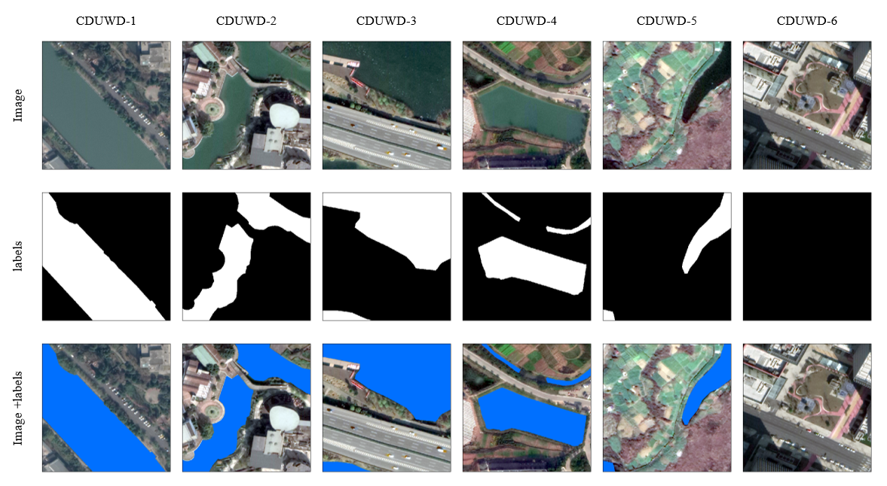

<div align="center">

# CDUWD 1.0: Chengdu Urban Waterbody Semantic Segmentation Dataset

[](#6-citation)
[](#download-section)
[](#license)
[](#)

*Precise City-Scale Urban Water Body Semantic Segmentation and Open-Source Sample Set Construction Based on Very High-Resolution Remote Sensing.*

[**📖 Read the Paper**](https://doi.org/10.3390/rs16203873) • [**⬇️ Download Dataset**](#download-section)

</div>

---

## 📸 Visual Teaser
<p align="center">
  
</p>

## 1. Introduction

The **Chengdu Urban Water Body Semantic Segmentation Dataset (CDUWD)** is explicitly designed to address persistent challenges in urban water body extraction, such as incomplete boundaries, misclassification, and the omission of small water bodies. 

CDUWD provides highly accurate, manually annotated training and evaluation resources tailored for state-of-the-art models (e.g., SegFormer). It enables efficient multi-scale urban water body segmentation in complex urban environments, serving crucial applications in urban planning, flood management, and ecological monitoring.

This dataset is officially released alongside our paper published in **Remote Sensing (MDPI)** by the research team from **Chengdu University of Technology**.

## 2. ✨ Highlights & Source Data

The source data is derived from Very High-Resolution (VHR) images from Google Earth, comprising **15 images** with a spatial resolution of **0.27 meters** (RGB bands). 

The dataset captures the intricate multi-scale features and variations of urban water bodies under complex backgrounds:
- 🌍 **Multi-scale Features:** Captures significant variations in water body spatial distribution and appearance.
- 🏙️ **Scene Variability:** Contrasts styles between dense urban cores and peripheral areas (from small/regular to large/irregular shapes).
- 🏗️ **Complex Backgrounds:** Addresses extraction difficulties caused by buildings, shadows, and complex spectral signatures.

## 3. Dataset Composition

From the source images, **77 sample points** were selected to extract $4000 \times 4000$ pixel sample images. After precise manual annotation and systematic cropping, the dataset was divided into two distinct resolution sets:
- **1024-Set:** 950 samples of $1024 \times 1024$ pixels.
- **512-Set:** 3800 samples of $512 \times 512$ pixels.

The dataset is categorized into **six semantic classes**:

| Subset ID | Water Body Type | Count | Percentage (%) |
| :---: | :--- | :---: | :---: |
| `CDUWD-1` | Main rivers | 192 | 20.2 |
| `CDUWD-2` | Small rivers | 162 | 17.1 |
| `CDUWD-3` | Lakes | 288 | 30.3 |
| `CDUWD-4` | Small water | 78 | 8.2 |
| `CDUWD-5` | Others water | 57 | 6.0 |
| `CDUWD-6` | Non-water | 173 | 18.2 |

## 4. Labeling Principles

To ensure robust model training, our manual annotations strictly adhered to the following principles:
1. **Minimum Size:** Water bodies under 50 pixels were excluded.
2. **Exclusions:** Dry riverbeds, dry ditches, and channels with unclear water presence were not annotated.
3. **Inclusions:** Ponds, artificial reservoirs, water-filled ditches, lakes, rivers, visibly flooded rice fields, and wetlands.
4. **Shadow Handling:** To maintain accurate morphological shapes, *shadows cast by buildings directly onto water surfaces* were also annotated as water bodies.

<a id="download-section"></a>
## 5. 📥 Download Links & Structure

You can access the full CDUWD dataset via the following platforms:

- ☁️ **Google Drive:** [Click here to access](https://drive.google.com/drive/folders/1Cf0IBprLtH44uvaNPdYILF7VYOaScwPx?usp=sharing)
- ☁️ **Baidu Netdisk:** [Click here to access](https://pan.baidu.com/s/1tQ2seau1Ilqo2RSt5ZBLqw?pwd=cdut) *(Access Code: `cdut`)*

### Directory Structure
Once downloaded, the dataset is organized as follows for plug-and-play integration with deep learning frameworks:

```text
CDUWD_Dataset/
├── 512/                          # 3800 samples (512x512)
│   ├── CDUWD-1/
│   │   ├── images/
│   │   └── labels/
│   ├── ...
│   └── CDUWD-6/
│       ├── images/
│       └── labels/
└── 1024/                         # 950 samples (1024x1024)
    ├── CDUWD-1/
    │   ├── images/
    │   └── labels/
    ├── ...
    └── CDUWD-6/
        ├── images/
        └── labels/
```

## 6. 📝 Citation

If you find the CDUWD dataset or our research helpful in your work, please consider citing our paper:

**Plain Text:**
> Cheng, X.; Zhu, Q.; Song, Y.; Yang, J.; Wang, T.; Zhao, B.; Shen, Z. Precise City-Scale Urban Water Body Semantic Segmentation and Open-Source Sampleset Construction Based on Very High-Resolution Remote Sensing: A Case Study in Chengdu. *Remote Sens.* **2024**, 16, 3873. https://doi.org/10.3390/rs16203873

**BibTeX:**
```bibtex
@article{cheng2024precise,
  title={Precise City-Scale Urban Water Body Semantic Segmentation and Open-Source Sampleset Construction Based on Very High-Resolution Remote Sensing: A Case Study in Chengdu},
  author={Cheng, Xi and Zhu, Qian and Song, Yujian and Yang, Jieyu and Wang, Tingting and Zhao, Bin and Shen, Zhanfeng},
  journal={Remote Sensing},
  volume={16},
  number={20},
  pages={3873},
  year={2024},
  publisher={MDPI},
  doi={10.3390/rs16203873}
}
```

## 7. 🙏 Acknowledgements

We would like to express our sincere gratitude to the **Graduate Quality Engineering Construction Funding Program of Chengdu University of Technology (2024YAL016)** for supporting this project. 

**Contributors:**
- **Chengdu University of Technology:** Xi Cheng, Qian Zhu, Yujian Song, Jieyu Yang, Tingting Wang
- **Aerospace Information Research Institute (Chinese Academy of Sciences):** Zhanfeng Shen, Haoyu Wang
